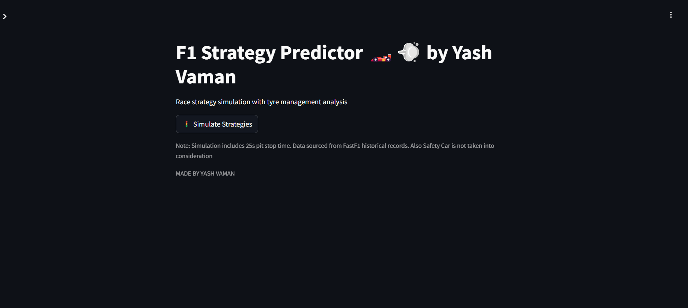
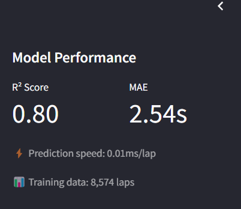
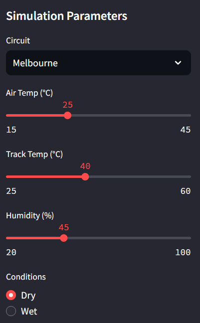
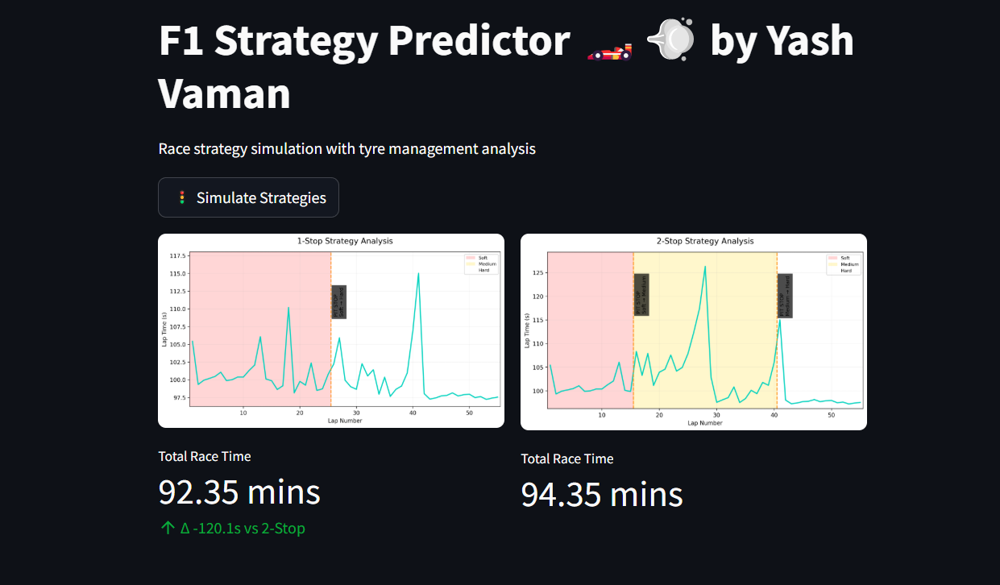
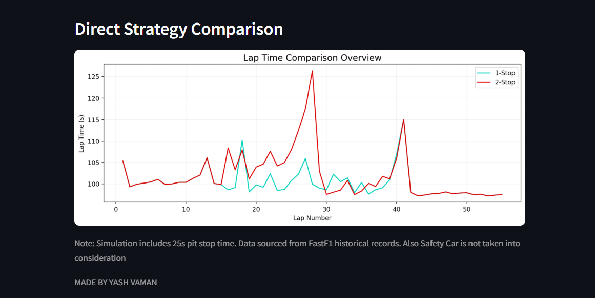

# F1 Race Strategy Predictor 🏎️⏱️

[](https://opensource.org/licenses/MIT)
[](https://www.python.org/)

## 🔍 Overview
A machine learning-powered tool that predicts optimal Formula 1 race strategies using historical telemetry data, weather conditions, and tyre degradation models.

## 🚀 Key Features
- Predicts 1-stop vs 2-stop strategies
- Tyre compound degradation visualization
- Weather impact simulation
- Historical data analysis (2022-2023 seasons)

## 🛠️ Tech Stack
| Component              | Technologies Used                             |
|------------------------|-----------------------------------------------|
| **Data Processing**    | FastF1, Pandas, NumPy                         |
| **Machine Learning**   | XGBoost, Scikit-learn                         |
| **Visualization**      | Matplotlib, Streamlit                         |
| **Deployment**         | Hugging Face Spaces, Google Colab             |

## ⚙️ Installation
```bash
# Clone repository
git clone https://huggingface.co/spaces/solosikoa/F1_Strat_Predictor 

# Install dependencies
pip install -r requirements.txt
```

## 📈 Usage
### Web App Version
1. Run Streamlit app locally:
```bash
streamlit run app.py
```
2. Access via Hugging Face: [Live Demo](https://huggingface.co/spaces/solosikoa/F1_Strat_Predictor)

### Notebook Version
[](https://colab.research.google.com/drive/1yfHjxNLwwg1hlrkd3ssgE71MguS3S-dD?usp=sharing)

## 📊 Visual Demonstration
<div align="center" style="display: grid; grid-template-columns: repeat(auto-fit, minmax(250px, 1fr)); gap: 1rem; margin: 2rem 0;">
  <a href="assets/a.png" target="_blank">
    
  </a>
  <a href="assets/b.png" target="_blank">
    
  </a>
  <a href="assets/c.png" target="_blank">
    
  </a>
  <a href="assets/d.png" target="_blank">
    
  </a>
  <a href="assets/e.png" target="_blank">
    
  </a>
</div>

<details>

</details>

## ✅ Core Advantages
- Real-time strategy simulation
- Uses actual F1 historical data
- Interactive parameter tuning
- Open-source and customizable

## ⚠️ Current Limitations
- Limited to 2022-2023 season data
- Simplified safety car modeling
- Basic tyre degradation assumptions
- Fixed pit stop duration (25s)

## 🔮 Future Development
- [ ] Real-time weather API integration
- [ ] Dynamic safety car probability
- [ ] 2024 season data support
- [ ] Driver performance profiles
- [ ] Multi-team strategy comparison

## 🤝 Contribution Guidelines
Contributions welcome! Please follow these steps:
1. Fork the repository
2. Create your feature branch (`git checkout -b feature/AmazingFeature`)
3. Commit changes (`git commit -m 'Add amazing feature'`)
4. Push to branch (`git push origin feature/AmazingFeature`)
5. Open a Pull Request

## 📜 License
Distributed under MIT License. See `LICENSE` for more information.

## ✉️ Contact
For questions/suggestions:  
[](https://linkedin.com/in/YashVaman)
